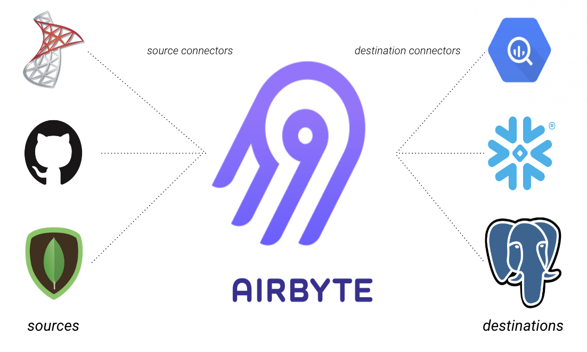

# Commoditizing data integration alongside Airbyte
<details>
<summary> Table of Contents</summary>

+ Background
    + What and how?
    + Specific Usefulness
+ [Developing your own Python *source* connector](#-Develop-a-Connector-(Python-source))
    + [Setup](#setup)
        + Java
        + Docker
        + Credentials
    + [Implementation](#implementation)
        + `spec()`
        + `check()`
        + `discover()`
        + `read()`
    + [Testing](#testing)
    + [Writing Documentation](#-Write-Documentation)
    

</details>

<div align="center">

</div>

<br>

Hello there! I'm Nate, a data engineer at [SLATE](https://slateco.io) (yes, the rhyme was why I was hired).

My purpose here is to give a little background on what's exciting about Airbyte to organizations like us and to demonstrate how you can extend its functionality to benefit the Airbyte community or just to suit your use-case. Some [documentation](https://docs.airbyte.io/integrations/custom-connectors) on this topic exists, but it didn't seem very sequential or comprehensive, so here we are.

For more info on how to use out-of-the-box Airbyte, explore [here](https://docs.airbyte.io/).

## What *is* Airbyte?

[Airbyte](https://airbyte.io/) soft-launched in late September 2020 as an open-source data integration platform. It's backed by a friendly group of engineers, enthusiastic community contributions, and some [impressive seed funding](https://airbyte.io/articles/our-story/we-raised-a-5m-seed-round-with-accel-to-commoditize-data-integration/).

<div align="center">

</div>

<br>

Their core product, a self-hosted EL(T) engine, effectively addresses the established need for an enterprise-scale solution to moving enterprise-scale amounts of data. It does this by abstracting the EL(T) process, using `connector` instances between sources, destinations and the all-orchestrating Airbyte instance.

## Airbyte's Unique Usefulness
I entered the data engineering space shortly after Airbyte came into being, and it seems that this coincidence has ended up drastically improving my life as a fresh lamb to the data engineering slaughter. 

If Airbyte wasn't around to do my job, I'd probably be writing all of our clients' EL(T)s in Python (maybe trying to learn Singer, Luigi, Airflow) or maybe would've become a consultant that advises clients they should pay a subscription to some low-code platform that likely exceeds their use-case... looking at you, Talend.

Thankfully, Airbyte does exist. At SLATE, we leverage their core EL(T) tool in dozens of use-cases to automatically move data at a near-arbitrary scale, paying for nothing but the deployment of the EC2 instances that run Airbyte.

So, to summarize how we find Airbyte useful:
- Airbyte allows us to avoid the potentially unsavory hours involved in re-purposing Python code to build one-off ELTs that are fast, schedule-able, and reliable
- Unlike many EL(T) platforms with subscription or usage-based pricing, Airbyte's open-source EL(T) engine is freely customizable and easily integrated into your own application or simple use-case.

Chances are that if you need for large-scale data integration, you're probably using a platform to store data that Airbyte handles out-of-the-box. [Here](https://docs.airbyte.io/integrations) you can find the full list of currently supported source and destination connectors.

### **I'll admit, that's cool... but I don't see the connector I want!**
..but, if you're like I was, then you need something beyond the standard integrations.

Now I'll outline how to add a connector to Airbyte, based on my experience implementing [Airbyte's Smartsheets source connector](https://github.com/airbytehq/airbyte/pull/2880).

If at any point you need help, feel free to reach out to the good folks in the [Airbyte slack community](https://airbyte.io/community/) or [me](mailto:nate.nowack@slateco.io).

# Develop a Connector (Python source)
In Airbyte-speak, source and destination connectors are different things - they require a different set of steps to implement. However, I found that learning to interact with Airbyte's deployment and OOP framework took the most time, which is common to both development workflows. 

So, hopefully you can still benefit from this article if you're here looking to make a new destination connector.

## Setup
### Gathering your Source's required Credentials
You first need to figure out what's required to programmatically connect and retrieve information from your desired data source. In my case, I needed:

- an API access Key that I obtained from the source platform
- the ID of the spreadsheet that I was going to replicate

What's required here is entirely dependent on how you choose to connect to your source, but keep in mind that ideally it shouldn't be too difficult for an end-user to configure an instance of your connector. 

### Development Environment
See [here](https://docs.airbyte.io/contributing-to-airbyte/developing-locally#troubleshooting) for the setup I outline below, but only from the horse's mouth.
- Install (if you don't have them already):
    - [Java (version 14 or above)](https://www.java.com/en/)
    - [npm (version 14 or above)](https://nodejs.org/en/download/)
    - Python 3.7 or above
    - Docker
- Fork Airbyte's master branch
- Clone the fork onto your machine
- From the root directory, run the following to get started:
```
$ cd airbyte-integrations/connector-templates/generator

$ npm install

$ npm run generate
```

You'll be prompted to select a bootstrapped source-template (Python, in my case) and then name your connector. Finally, to build your template and prepare a virtual environment with the required dependencies, run the follwing:

```
$ cd airbyte-integrations/connectors/source-<name>

$ python -m venv .venv 

$ source .venv/bin/activate # enable the venv

$ pip install -r requirements.txt
```


The code scaffolding that you will need to edit now exists in a directory called `source-<yourconnectorname>` within `airbyte/airbyte-integrations/connectors/`. 


<div align="center">


*IT'S TIME TO IMPLEMENT!*

</div>

## Implementation
While your connector's implementation is going to platform specific, all Airbyte source connectors are written as a class with the 3 methods outlined below.

```python
# main class definition for your source
class SourceSmartsheets(Source):

    # "check" that your credentials give a good connection to your data source
    def check(self, logger, config) -> AirbyteConnectionStatus:
        # TODO


    # create your source's JSONschema catalog from column names and types
    def discover(self, logger, config) -> AirbyteCatalog:
        # TODO


    # create an AirbyteMessage for each record from your source's catalog
    def read(self, logger, config, catalog, state) -> Generator:
        # TODO

```
It's likely going to be helpful to check out [these docs](https://docs.airbyte.io/tutorials/building-a-python-source) during these implementations, but I'll describe where I got stuck during the process and how I got around it.

# `spec.json`
The first file to edit in our newly-generated directory is the JSON Schema configuration. This where you specify what credentials an end-user would need to use your connector in Airbyte. In the case of my source connector, I'm using the Smartsheets API under the hood so users of my connector need to provide both **an API token** and **their Smartsheet's ID**.
```json
{
  "documentationUrl": "https://docs.airbyte.io",
  "connectionSpecification": {
    "$schema": "http://json-schema.org/draft-07/schema#",
    "title": "Smartsheets Source Spec",
    "type": "object",
    "required": ["access_token", "spreadsheet_id"],
    "additionalProperties": false,
    "properties": {
      "access_token": {
        "title": "API Access token",
        "description": "Found in Profile > Apps & Integrations > API Access within Smartsheet app",
        "type": "string",
        "airbyte_secret": true
      },
      "spreadsheet_id": {
        "title": "Smartsheet ID",
        "description": "Found in File > Properties",
        "type": "string"
      }
    }
  }
}
```
**NOTE** that the elements of the `required` list are those pieces of information an end-user of your connector would need, so if you're not using a token / ID combo like me then make sure to name these appropriately (e.g. username, password, hostname, port, etc).

The `description` field for each `required` will pop up as alongside its corresponding field in Airbyte during setup, so give hints for acquiring this info or direct users to what will be your documentation.

There! You've implemented the first part of your new Airbyte connector. 

# `check`
Like the rest below, this function is one of those scaffolded methods of your connector's class, just waiting for you to implement it. The `check` method is supposed to take user credentials outlined in `spec.json` and somehow check with the data source that they are valid. 

If you're using an API to connect to your source, like Smartsheets or Google Sheets, the request reponse code can typically be found in the object returned by the client's `connect` method. Try:
```python 
print(yourClient.yourConnectionObject.__dict__)
```
... and see if you have a response code in there somewhere! Unless you successfully connect to the wrong source, chances are that a `200` status code in your response is what you need!

If you're not using an API, you'll have to decide what constitutes a successful connection to your source. 

As outlined below, that's conceptually it for this step. To follow [Airbyte best practices](https://docs.airbyte.io/contributing-to-airbyte/building-new-connector/best-practices#principles-of-developing-connectors) and wrap up this step: add exception handling,  actionable error messages for the `AirbyteLogger`, and `return` an `AirbyteConnectionStatus` object with `status` set to either `Status.SUCCEEDED` or `Status.FAILED`, depending on your definition of a "successful connection". Here's what my `check` method looked like:


```python
def check(self, logger: AirbyteLogger, config: json) -> AirbyteConnectionStatus:
    try:
        access_token = config["access_token"]
        spreadsheet_id = config["spreadsheet_id"] + 1

        smartsheet_client = smartsheet.Smartsheet(access_token)
        smartsheet_client.errors_as_exceptions(True)
        smartsheet_client.Sheets.get_sheet(spreadsheet_id)

        return AirbyteConnectionStatus(status=Status.SUCCEEDED)
    except Exception as e:
        if isinstance(e, smartsheet.exceptions.ApiError):
            err = e.error.result
            code = 404 if err.code == 1006 else err.code
            reason = f"{err.name}: {code} - {err.message} | Check your spreadsheet ID."
        else:
            reason = str(e)
        logger.error(reason)
    return AirbyteConnectionStatus(status=Status.FAILED)
```
**NOTE** that one of the inputs of `check` is `config`, which is basically a JSON object that you can assume contains the user's credentials as outlined in `spec.json`.
# `discover`
Next, we need to specify to Airbyte how to find column names and types from our source. To do this, we create an `AirbyteCatalog` that lists the distinct `streams` of data to be replicated by the connector.

For context: 
- the MSSQL connector has a `stream` for each selected table in the relevant database schema
- the Google Sheets connector has a `stream` for each individual sheet within the spreadsheet
- in my case, Smartsheets can only have one sheet, so I only had one `stream`

To make a `stream`, you need a `name` and a `json_schema`. The `name` can be anything but make it descriptive, and the `json_schema` you have to setup from your knowledge of the data source's typing of columns. 

Here's a sample of what a properly configured `json_schema` looks like: 
```json
{
    "$schema": "http://json-schema.org/draft-07/schema#",
    "type": "object",
    "properties": {
        "column1": {
            "type": "string"
        },
        "column2": {
            "type": "number"
        }
    }
}
```
**NOTE** that the `"$schema"` key references a [JSON Schema](https://json-schema.org/) template adopted by Airbyte, so just copy that and the `"type": "object"` key / value pair. All you need to do is figure out how to populate the `properties` object with type information for each column in a given `stream`.

I used a couple helper functions to do this (shown below):
- `get_prop` for conforming Smartsheet typing convention to [Airbyte types](https://docs.airbyte.io/architecture/basic-normalization#typing)
- `get_json_schema` for generating the `json_schema` in the required format given the type-mapping.

```python 
# Mapping Smartsheet types to acceptable Airbyte types
def get_prop(col_type: str) -> Dict[str, any]:
    props = {
        "TEXT_NUMBER": {"type": "string"},
        "DATE": {"type": "string", "format": "date"},
        "DATETIME": {"type": "string", "format": "date-time"},
    }
    if col_type in props.keys():
        return props[col_type]
    else:  # assume string
        return props["TEXT_NUMBER"]

# Create dictionary representing the JSON schema for this sheet
def get_json_schema(sheet: Smartsheet) -> Dict:
    column_info = {i["title"]: get_prop(i["type"]) for i in sheet["columns"]}
    json_schema = {
        "$schema": "http://json-schema.org/draft-07/schema#",
        "type": "object",
        "properties": column_info,
    }
    return json_schema
```

With the JSON Schema created, you can then instantiate an `AirbyteStream` for each distinct source of data within your configured source - if, unlike me, you have more than one per data source!

Again, fail early and actionably to help out the end-user trying to use your connector. Now just `return` your fancy-schmancy `AirbyteCatalog` as shown below, and let Airbyte do the discovery from now on.

**NOTE** You're going to want to test this step by printing the `json_schema` to somewhere you can check that it looks right. You can also use a `pydantic` [dataclass](https://pydantic-docs.helpmanual.io/usage/dataclasses/) if you want to specify upfront what it should look like!

Here's the full `discover` method I ended up with:

```python
def discover(self, logger: AirbyteLogger, config: json) -> AirbyteCatalog:
    access_token = config["access_token"]
    spreadsheet_id = config["spreadsheet_id"]
    streams = []

    smartsheet_client = smartsheet.Smartsheet(access_token)
    try:
        sheet = smartsheet_client.Sheets.get_sheet(spreadsheet_id)
        sheet = json.loads(str(sheet))  # make it subscriptable
        sheet_json_schema = get_json_schema(sheet)

        logger.info(f"Running discovery on sheet: {sheet['name']} with {spreadsheet_id}")

        try:
            stream = AirbyteStream(
                name=sheet["name"], 
                json_schema=sheet_json_schema)
            streams.append(stream)
        except Exception as e:
            rec = "Check that your source's column names don't contain spaces or _"
            logger.error(f"Stream creation failed: {str(e)} - {rec} ")
    except Exception as e:
        raise Exception(f"Could not run discovery: {str(e)}")

    return AirbyteCatalog(streams=streams)
```
Don't worry just yet about testing your methods in series, each method can be developed and tested in isolation using the provided `main_dev.py` or running the Docker-based test of that method. Both methods of iterative testing are outlined [here](https://docs.airbyte.io/tutorials/building-a-python-source#iterating-on-your-implementation).

# `read`
Here we are - this is the last method of our ` class SourceYourFancySourceName` that we have to write!

Essentially, the logic here is:
- for each stream:
    - for each row in a stream:
        - define a `dict` with elements like: `{column name : column's value in given row}`
        - pass this `dict` to Airbyte as an `AirbyteRecord`

For example, say that your source table has 5 records with columns names `date`, `stock_ticker`, and `price`. Then, the below is the `data` that you would need to pass to Airbyte. 
```json
{"date": "2020-12-15", "stock_ticker": "TSLA", "price": 633.25}
{"date": "2020-12-16", "stock_ticker": "TSLA", "price": 622.77}
{"date": "2020-12-17", "stock_ticker": "TSLA", "price": 655.9}
{"date": "2020-12-18", "stock_ticker": "TSLA", "price": 695}
{"date": "2020-12-21", "stock_ticker": "TSLA", "price": 649.86}

```
How this actually happens in the Airbyte OOP framework is slightly weird, but not too difficult at all.

- For each row of `data`, create an `AirbyteRecordMessage` with your stream name, `data`, and current time. 
- Instantiate an `AirbyteRecord` by passing in your `AirbyteRecordMessage` along with it's `type` as `Type.RECORD`

Below is my implementation. 

```python
def read(
    self,
    logger: AirbyteLogger,
    config: json,
    catalog: ConfiguredAirbyteCatalog,
    state: Dict[str, any]
) -> Generator[AirbyteMessage, None, None]:

    access_token = config["access_token"]
    spreadsheet_id = config["spreadsheet_id"]
    smartsheet_client = smartsheet.Smartsheet(access_token)

    for configured_stream in catalog.streams:
        stream = configured_stream.stream
        properties = stream.json_schema["properties"]
        if isinstance(properties, list):
            columns = tuple(key for dct in properties for key in dct.keys())
        elif isinstance(properties, dict):
            columns = tuple(i for i in properties.keys())
        else:
            logger.error("Could not read properties from the JSONschema in this stream")
        name = stream.name

        try:
            sheet = smartsheet_client.Sheets.get_sheet(spreadsheet_id)
            sheet = json.loads(str(sheet))  # make it subscriptable
            logger.info(f"Starting syncing spreadsheet {sheet['name']}")
            logger.info(f"Row count: {sheet['totalRowCount']}")

            for row in sheet["rows"]:
                values = tuple(i["value"] for i in row["cells"])
                try:
                    data = dict(zip(columns, values))

                    yield AirbyteMessage(
                        type=Type.RECORD,
                        record=AirbyteRecordMessage(stream=name, data=data, emitted_at=int(datetime.now().timestamp()) * 1000),
                    )
                except TypeError as e:
                    logger.error(f"{e}: BOGUS!")

        except Exception as e:
            logger.error(f"Could not read smartsheet: {name}")
            raise e
    logger.info(f"Finished syncing spreadsheet with ID: {spreadsheet_id}")
```
**NOTE** You might notice that I have a weird few `if` `else` blocks in there - that is just to catch `TypeError` inconsistencies between my dev environment and Airbyte's Docker-based environment. Suffice to say, try to use the Docker-based environment for iterative test and ... [don't use a mutable type as a dictionary key](https://www.google.com/url?sa=i&url=https%3A%2F%2Fwww.designboom.com%2Fart%2Fthumbs-ammo-replaces-movie-guns-with-a-thumbs-up%2F&psig=AOvVaw3fwWO0qgFkWRoH51ymRGaQ&ust=1619741469993000&source=images&cd=vfe&ved=0CAIQjRxqFwoTCLCvtq2VovACFQAAAAAdAAAAABAD).

<br>

You got through all the implementation steps, it is time to test your connector!

<div align="center">

</div>

# Testing

To check that your connector passes Airbyte's baseline Integration Tests, naviagte back out to the root directory and run the following:

```
$ ./gradlew clean:airbyte-integrations:connectors:source-<name>:build

$ ./gradlew clean :airbyte-integrations:connectors:source-<name>:integrationTest
```

This is going to package your connector into a Docker image and check your code's basic functionality and compliance with the Airbyte framework. It'll likely take a couple minutes to build your code and run all the tests. 

If it errors out, use the prompts to run it again with a stack-trace to debug (and/or use the suggested flag to generate a helpful gradle build summary in your browser).


### Unit Tests
To make your connector extra robust, you can add unit tests to check your methods' functionalities. See the [Google Sheets connector's repo](https://github.com/airbytehq/airbyte/blob/master/airbyte-integrations/connectors/source-google-sheets/unit_tests/test_helpers.py) for a good reference.

### Test your connector in the UI
Before you open that PR and pop that bubbly, you might want to actually try your new connector in the Airbyte UI to make sure everything works as expected.

[Here](https://docs.airbyte.io/tutorials/building-a-python-source#step-11-add-the-connector-to-the-api-ui) is a description that I could only make worse on how to do this.

# Write Documentation
Use another connector's documentation as a template to write your own connector's docs, focusing on the unique behaviours.

Here is where the documentation files live: 

```
airbyte/docs/integrations/sources/<source-name>.md
```

# Open a merge request
Now, you just have to open a merge request: your fork > Airbyte's master branch. Coordinate on this with Airbyte's friendly engineers - they will help you through the rest of the process.

<br>
<div align="center">
You have now helped Airbyte improve open-source data integration - for yourself, the world, or both!


*VICTORY SCREECH!!!*

</div>
