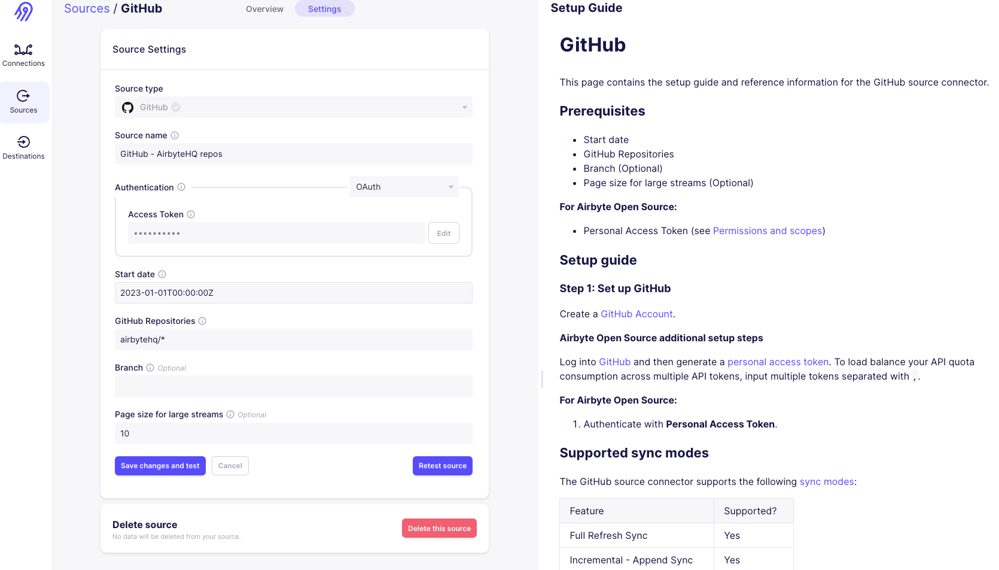
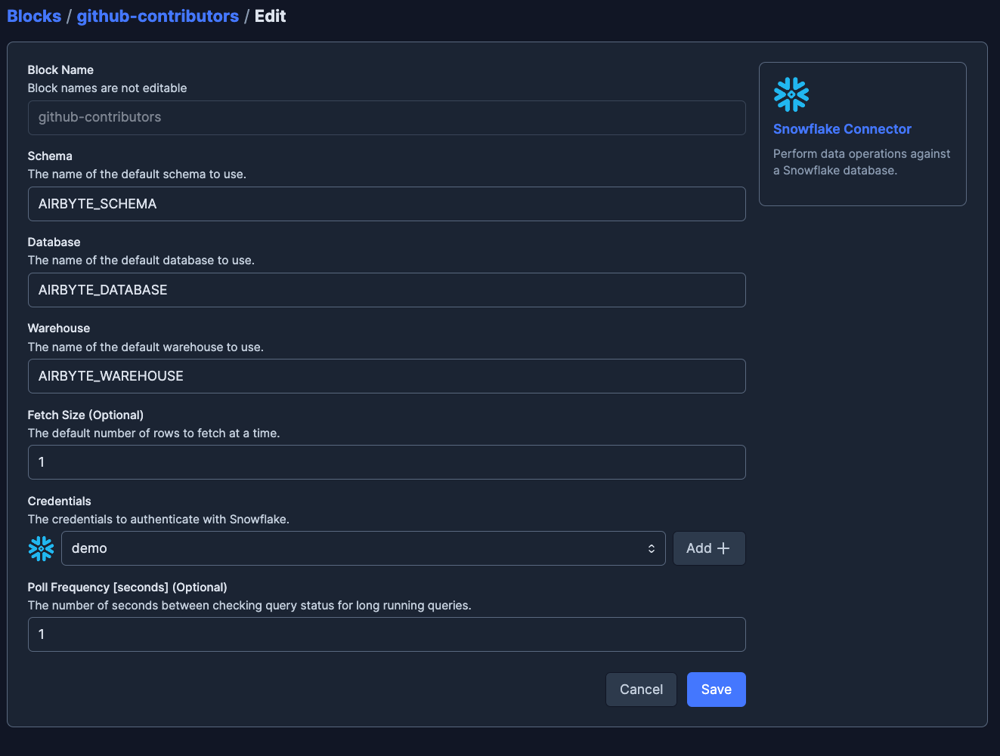
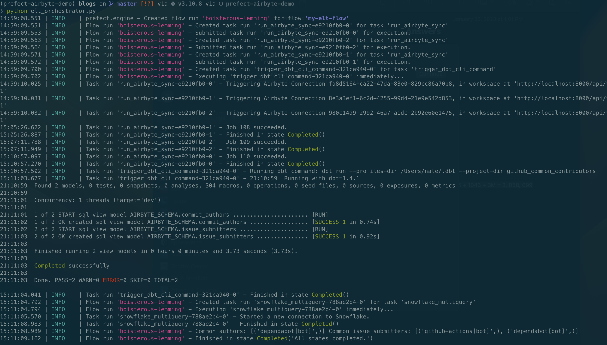

# Using Prefect to sync (Airbyte, dbt, Snowflake, ...) with `python`

<div style="text-align:center"></div>

When wrangling data on a small team, its hard not to rely on tools to help us get event data from the world to our data consumers - they're just too useful to ignore! 

Though, as a data practice scales it can get difficult to keep track of all the moving parts if your tools' interactions are not *automated* and *visible*.

Using an orchestrator like [Prefect](https://www.prefect.io/), you can automate and observe tools in your stack using simple Python code.

---

This tutorial is meant as a quickstart to a simple, scalable, and maintainable ELT pipeline using an open-source stack of tools (and a free tier datawarehouse). We'll be using:
- [Airbyte](https://airbyte.io/) to **extract** data sources and **load** them to a datawarehouse (like [Snowflake](https://www.snowflake.com/))
- [dbt](https://www.getdbt.com/) to **transform** the data
- [Prefect](https://www.prefect.io/) to **automate** and **observe** our ecosystem of tools
- GitHub as a fun source of event data and a place to store our code

## Setup an Airbyte instance
This tutorial is based on Open-Source Airbyte. If you are using Airbyte Cloud, you'll need to [wait for the Airbyte Cloud API](https://app.harvestr.io/roadmap/view/pQU6gdCyc/airbyte-roadmap) to programmatically interact with Airbyte from Prefect.

To setup a local Airbyte instance, follow the [Airbyte Quickstart](https://docs.airbyte.com/quickstart/deploy-airbyte/) guide or use a helm chart ([if that's your thing](https://docs.airbyte.com/deploying-airbyte/on-kubernetes-via-helm#add-helm-repository))

### ⏰ tl;dr - if you just want to run it locally right now
1. [Install Docker and Docker Compose](https://docs.docker.com/get-docker/) on your machine
2. Paste and run the following command in your terminal:
```bash
git clone https://github.com/airbytehq/airbyte.git
cd airbyte
docker compose up
```
3. Open http://localhost:8000/ in your browser to access the Airbyte UI and provide the default authentication values (you can change these later):
- **username**: airbyte
- **password**: password

## Create some **Airbyte** connections
For this tutorial, we'll use the [Airbyte GitHub source connector](https://docs.airbyte.io/integrations/sources/github) to pull data from the GitHub organizations whose repositories are used in this tutorial:
- [airbytehq/airbyte](https://github.com/AirbyteHQ/airbyte)
- [prefecthq/prefect](https://github.com/PrefectHQ/prefect)
- [dbt-labs/dbt-core](https://github.com/dbt-labs/dbt-core)

Once we tell Airbyte how to connect to grab data from GitHub, we'll tell it how to write the data to our datawarehouse. For this tutorial, we'll use the [Airbyte Snowflake connector](https://docs.airbyte.io/integrations/destinations/snowflake) to write data to our Snowflake database `AIRBYTE_DATABASE` in the `AIRBYTE_SCHEMA`.


### Create a **GitHub** source connection
All Airbyte needs to connect to GitHub is a valid [personal access token](https://docs.github.com/en/github/authenticating-to-github/creating-a-personal-access-token).

Let's go ahead and create a new connection in the Airbyte UI by clicking on the **Sources** tab and click **+ New Source**. Select the **GitHub** source connector and pass along your token (or comma-separated list of tokens to distribute load across multiple actors):



For this tutorial, we'll create a connection for each of the three GitHub organizations we're interested in, grabbing the repository of interest for each organization.

### Create a **Snowflake** destination connection
To tell Airbyte where to drop our raw data in Snowflake, we'll need to provide the following information:
- **account**: the name of your Snowflake account
- **username**: the username of the user that Airbyte will use to connect to Snowflake
- **password**: the password of the user that Airbyte will use to connect to Snowflake
- **database**: the name of the database that Airbyte will use to write data to
- **schema**: the name of the schema that Airbyte will use to write data to

Let's go ahead and create a new connection in the Airbyte UI by clicking on the **Destinations** tab and click **+ New Destination**. Select the **Snowflake** destination connector and pass in the information above.

> 💡 **Note**: While you've got this info handy, you can also use it to connect your dbt CLI to Snowflake. See the [dbt docs](https://docs.getdbt.com/docs/get-started/connection-profiles) for more info - psst `dbt debug` is your friend!

## Create some **dbt** models to transform the raw data
Now that we've given Airbyte the ability to pull data from GitHub and write it to Snowflake, we can use dbt to transform the raw data into a format that's more useful for our downstream consumers (like BI tools, fun dashboards, and downstream dbt models).

While not the focus of this tutorial, the source code for the dbt models we'll be using can be found [here](https://github.com/desertaxle/airbyte-prefect-recipe).

For fun, we create two models: **common_commiters** and **common_issue_submitters**. These will create views in Snowflake containing the committers and issues submitters that are common across all three repositories. We’ll then be able to query these views and check out the overlap between the three communities.

## Write a **Prefect** flow to orchestrate our tools

### Let's use some Prefect collections to make our lives easier
```bash
pip install prefect-airbyte prefect-dbt prefect-snowflake # its 2023, use a venv
```

Nice! and now let's import some of their useful functionality for our flow:
```python
from prefect_airbyte import AirbyteConnection, AirbyteServer
from prefect_dbt.cli.commands import trigger_dbt_cli_command
from prefect_snowflake.database import SnowflakeConnector, snowflake_multiquery
```

### Define a **Prefect** flow
It's often useful to take a step back and think about each of the steps we want to take in our flow. In this case, we want to:
- trigger some existing Airbyte connections to drop raw data into our Snowflake database
- run some dbt models to transform the raw data into something more useful
- query the transformed data to see what's up

Let's see what that looks like for each of these steps!

#### **Run some Airbyte connections**
Lucky for us, the `AirbyteConnection` block defined in `prefect-airbyte` takes care of the hard work for us. If we tell it which connection to trigger and which Airbyte server to use, it'll do the rest! Let's create some `AirbyteConnection` blocks:

```python
airbyte_server = AirbyteServer(server_host="localhost", server_port=8000)

airbyte_connections = [
    AirbyteConnection(
        connection_id=connection_id,
        airbyte_server=airbyte_server
    )
    for connection_id in [
        "fa8d5164-ca22-47da-83e0-829cc86a70b8", # Airbyte Github Stats
        "8e3a3ef1-6c2d-4255-99d4-21e9e542d853", # DBT Github Stats
        "980c14d9-2992-46a7-a1dc-2b92e60e1475" # Prefect Github Stats
    ]
]
```
...and a task to trigger them:
```python
@task
def run_airbyte_sync(connection: AirbyteConnection) -> AirbyteSyncResult:
    job_run = connection.trigger()
    return job_run.wait_for_completion()
```

#### **Run some dbt models**
This one is pretty simple, we just need to tell `trigger_dbt_cli_command` (a pre-defined Prefect task) what command to run and which dbt project to use:
```python
dbt_result = trigger_dbt_cli_command( # run dbt models
    command="dbt run",
    project_dir="github_common_contributors",
    wait_for=airbyte_results
)
```
Notice the use of `wait_for` here. This tells Prefect that we want to make sure the airbyte tasks have successfully dropped raw data in Snowflake before we try to transform it with dbt.

> 💡 **Note**: If you're using dbt Cloud, you can use the functionality defined in `prefect-dbt.cloud` instead.

#### **Run some queries against the transformed data**
Assuming we now have transformed data, we just need to tell Prefect how to connect to Snowflake and what queries to run. The first part can be accomplished by creating a `SnowflakeConnector` block:



> 💡 **Note**: A `SnowflakeConnector` needs a set of [`SnowflakeCredentials` to auth with Snowflake](https://prefecthq.github.io/prefect-snowflake/credentials/). As with any block, you can create this in the UI or programmatically.

Now we can use our `SnowflakeConnector` to connect to the right place in Snowflake and `snowflake_multiquery` (another pre-built task) to ask questions about the transformed data that lives there:
```python
common_authors, common_issue_submitters = snowflake_multiquery(
    queries=[
        "select login from commit_authors",
        "select login from issue_submitters"
    ],
    snowflake_connector=SnowflakeConnector.load("github-contributors"),
    wait_for=dbt_result
)
```
In the same way as before, we use `wait_for` to make sure the dbt models have successfully run before we try to query the transformed data.


### **the whole enchilada**
Pretty nifty, huh? Let's put it all together into a `@flow`:
```python
@flow(log_prints=True)
def my_elt_flow():
    airbyte_results = run_airbyte_sync.map(airbyte_connections)

    dbt_result = trigger_dbt_cli_command(
        command="dbt run",
        project_dir="github_common_contributors",
        wait_for=airbyte_results
    )

    common_authors, common_issue_submitters = snowflake_multiquery(
        queries=[
            "select login from commit_authors",
            "select login from issue_submitters"
        ],
        snowflake_connector=SnowflakeConnector.load("github-contributors"),
        wait_for=dbt_result
    )
    print(
        f"Common authors: {common_authors} "
        f"Common issue submitters: {common_issue_submitters}"
    )

if __name__ == "__main__":
    my_elt_flow()
```


### **Running our flow**
To run our flow locally, we can simply run the script:
```python
python elt_orchestrator.py
```
...and watch it go 🚀



Now let's create a deployment for our flow so we can run it when and where we want.

To do this, we need to make two decisions:
- where do we want to run our flow?
- where do we want to store our flow?

To keep things simple, I'll run our code locally and keep it in GitHub (where it is anyways!).

In terms of prefect deployments, that means I'm using the default [Process infrastructure](https://docs.prefect.io/concepts/infrastructure/#process) and a [GitHub filesystem block](https://docs.prefect.io/api-ref/prefect/filesystems/#prefect.filesystems.GitHub).

With these choices made, the command to create the deployment looks like:
```bash
prefect deployment build elt_orchestrator:my_elt_flow -n "elt-pipeline" -sb github/demo-repo
```

> 💡 **Note**: If we wanted to use a different runtime infrastructure (like Kubernetes), we could specify that in the `prefect deployment build` command by passing `-ib kubernetes/my-k8s-job-template`

With our new deployment created, we could hop over to the UI and run it manually, or attach an interval / cron schedule to it.

The nice thing about this setup is that if one piece of our pipeline fails, we won't run the rest of it. It wouldn't make sense to run our dbt models if our Airbyte syncs failed, and it wouldn't make sense to run our queries if our dbt models failed - it would just be a waste of time and resources.